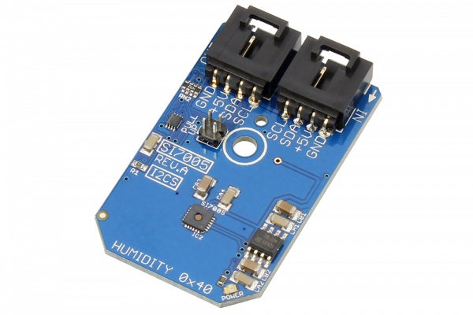

# SI7005

The SI7005 is a digital relative humidity and temperature sensor.
This Device is available from www.ncd.io 

[SKU: SI7005_I2CS]

(https://store.ncd.io/product/si7005-humidity-and-temperature-sensor-%C2%B14-5rh-%C2%B10-5c-i2c-mini-module/)
This Sample code can be used with Arduino.

Hardware needed to interface SI7005 sensor with Arduino

1. <a href="https://store.ncd.io/product/i2c-shield-for-arduino-nano/">Arduino Nano</a>

2. <a href="https://store.ncd.io/product/i2c-shield-for-arduino-micro-with-i2c-expansion-port/">Arduino Micro</a>

3. <a href="https://store.ncd.io/product/i2c-shield-for-arduino-uno/">Arduino uno</a>

4. <a href="https://store.ncd.io/product/dual-i2c-shield-for-arduino-due-with-modular-communications-interface/">Arduino Due</a>

5. <a href="https://store.ncd.io/product/si7005-humidity-and-temperature-sensor-%C2%B14-5rh-%C2%B10-5c-i2c-mini-module/">SI7005 Temperature and humidity Sensor</a>

6. <a href="https://store.ncd.io/product/i%C2%B2c-cable/">I2C Cable</a>

SI7005:

The SI7005 is a digital relative humidity and temperature sensor.

Applications:

• Respiratory therapy,white goods,asset/goods tracking and automotive climate control.

How to Use the SI7005 Arduino Library

The SI7005 has a number of settings, which can be configured based on user requirements.
          
1.Address calling:The following command is used to call the SI7005 sensor to begin the transmission.

          si.getAddr_SI7005(SI7005_DEFAULT_ADDRESS);           // 0x40
            
2.Fast mode:The following command is used to ENABLE the Fast mode.

          si.setFastEnable(FAST_ENABLE_35);        // 35 ms (typicalt)     

3.Heater status:The following command is used to DISABLE the heater.

          si.setHeaterEnable(HEATER_OFF);      // Heater Off
             
4.Conversion mode:The following command is used to start the conversion mode.        
             
         si.setConversion(CONVERSION_START);       // Start a conversion
          
